# chunk_size EDA — 핵심 인사이트

*차트는 `EDA_그래프/` 폴더, 실제 테이블 일부는 2페이지(`GPT_PPT_2_EDA_테이블_2026-07-27.md`) 참고.*

---

## 인사이트 1: chunk_size는 결국 "문서 길이"에 맞추는 문제였다

문서유형별로 원문(청킹 전) 길이 자체가 다름 — doc_page는 원래 길고(중앙값 807토큰, 최대 23,665토큰), action_schema/package_overview는 원래 짧음(71~400토큰).

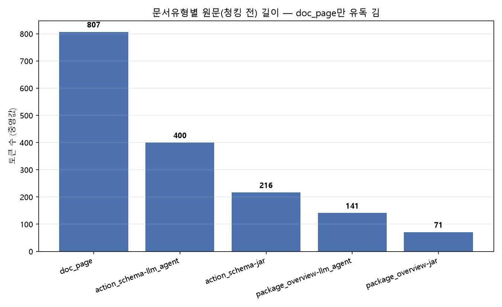

→ chunk_size를 키워서 이득 보는 건 사실상 **doc_page뿐**. action_schema/package_overview는 원래 짧아서 chunk_size와 거의 무관해짐 — "청크를 어떻게 잘라도 티가 안 나는 문서 유형"이 따로 있다는 뜻.

---

## 인사이트 2: chunk_size가 커질수록 효과는 완만하게 포화된다

한 청크로 통째로 안 쪼개지는 문서 비율이 chunk_size와 함께 계속 늘지만, 늘어나는 폭 자체는 점점 줄어듦(급격한 꺾임이 아니라 완만한 둔화).

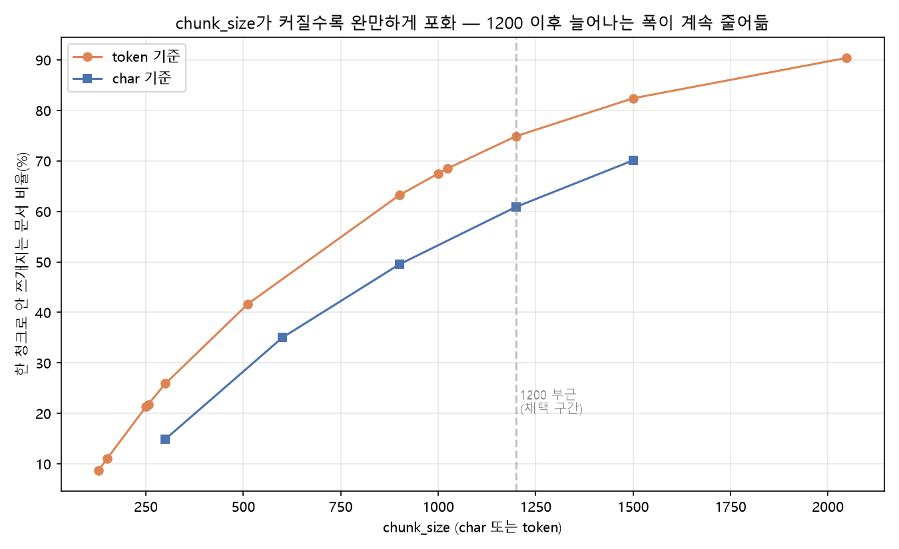

char/token 각각 막대그래프로 증가폭(%p)까지 표시하면 더 명확함:

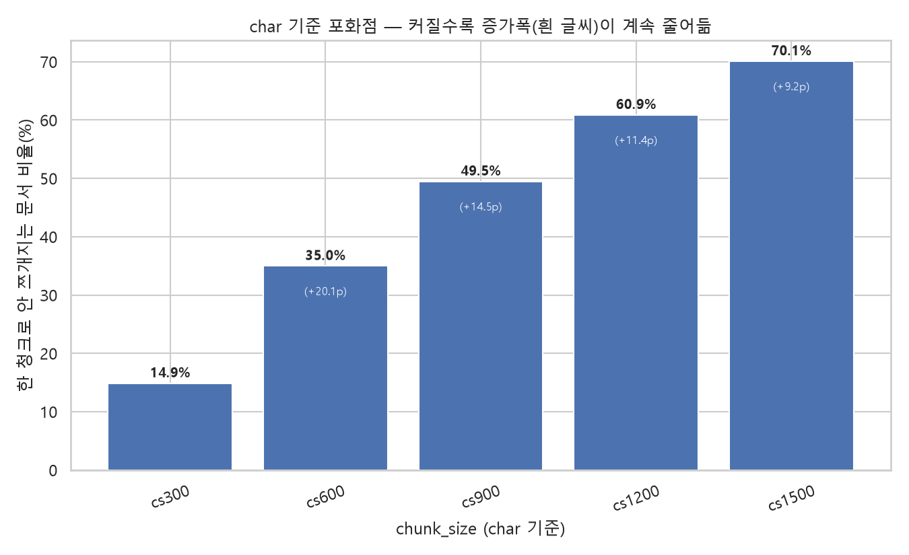
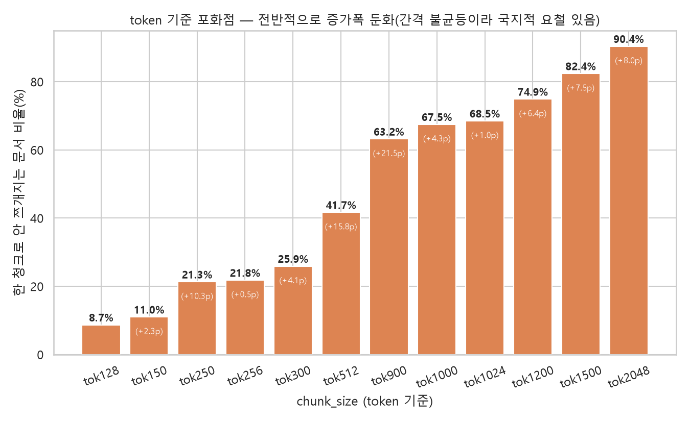

→ 1200(char)/1024(token) 부근이면 이미 60~70%대 문서가 한 청크에 담김 — 더 키워도(1500, 2048...) 늘어나는 비율은 계속 작아짐. (char는 간격이 일정해 증가폭 감소가 깔끔하게 보이고, token은 tok1000/1024처럼 간격이 촘촘한 구간이 섞여 있어 국지적으로 들쭉날쭉하지만 전반적 추세는 동일)

---

## 인사이트 3: 검색 지표는 방향이 반대로 갈리지만, 실제 답변 품질은 한쪽 편이다

- **작은 청크 → Hit@1 유리** (정답 문서를 정확히 1등으로 뽑음)
- **큰 청크 → EvidenceCoverage 유리** (근거를 충분히 담음)

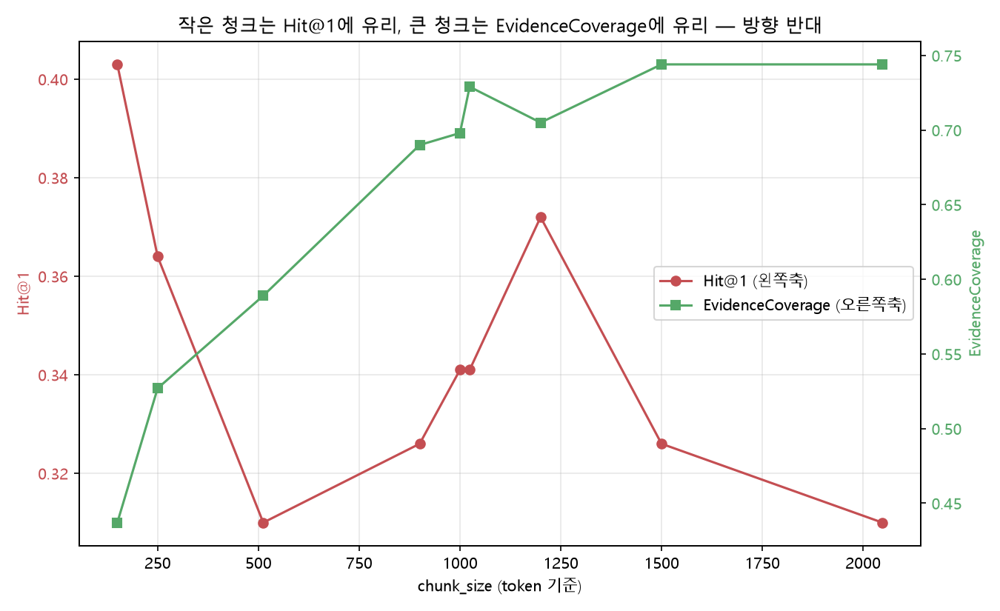

이 둘은 트레이드오프 관계라 동시에 최고일 수 없음. 그런데 실제 생성된 답변의 품질(Faithfulness 등 RAGAS 지표)은 **EvidenceCoverage 쪽 경향을 따라감** — "정답 문서를 얼마나 정확히 1등으로 뽑았나"보다 "근거를 얼마나 충분히 가져왔나"가 답변 품질에 더 직결됨.

→ 이게 작은 청크 대신 큰 청크를 선택한 실질적 이유.

---

## 인사이트 4: gold 근거는 1200(char)/1024(token) 부근에서 이미 98%+ 안전권

정답 근거 스니펫이 청크 경계에서 안 잘리고 한 청크에 온전히 담기는 비율.

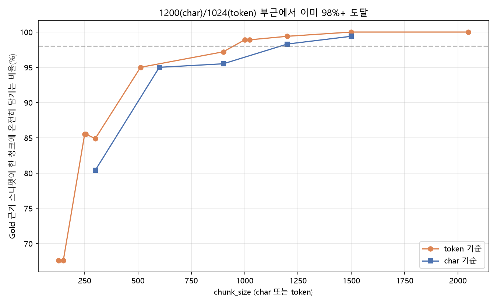

char/token 각각 막대그래프로 보면:

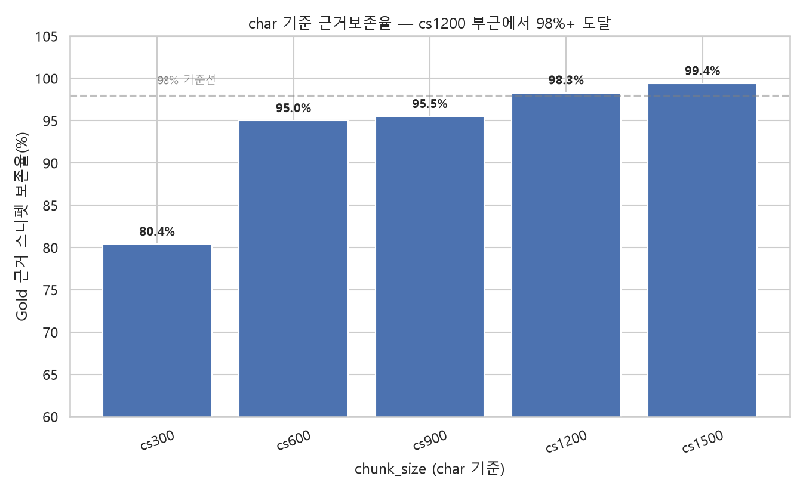
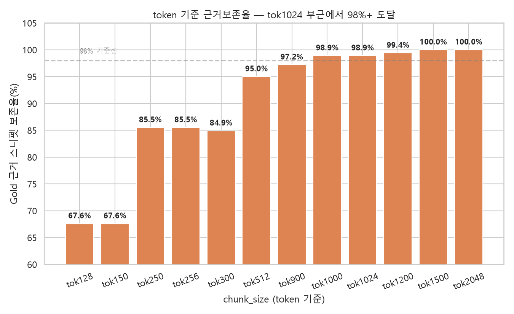

→ 1200(char)/1024(token) 부근이면 이미 98%+ 도달 — 이보다 작으면(300~600대) 근거가 청크 경계에서 잘리는 사례가 눈에 띄게 늘어남.

---

## 인사이트 5: chunk_size 캡이 커질수록 실제 청크 길이의 "변동폭"도 커진다

평균/중앙값만 보면 놓치는 부분 — 실제 청크 길이 분포 자체를 boxplot으로 보면, cs300은 상자(사분위 범위)가 좁고 촘촘한데 cs1500은 상자가 훨씬 넓음(0에 가까운 청크부터 1900토큰에 가까운 청크까지 다양).

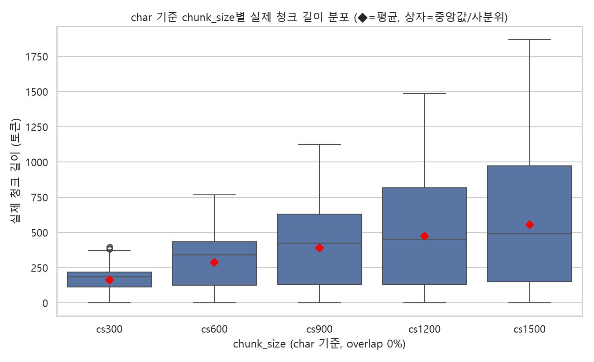

→ chunk_size를 키우면 "평균적으로 더 큰 청크"가 되는 게 아니라 **"청크 길이가 훨씬 들쭉날쭉해진다"**는 부작용이 있음 — 어떤 청크는 원문이 짧아 여전히 작고, 어떤 청크는 캡 근처까지 채워짐.

**token 기준은 이 현상이 더 심함**(`6_token_청크길이_boxplot.png`) — 평균은 7배(113.7→788.0) 늘어나는 동안 IQR은 **25배**(40→998.2) 늘어남. 다만 tok1200 이후로는 IQR도 거의 안 늘어남(939→997→998.2) — 변동폭 관점에서도 tok1200 부근이 포화점.

---

## 인사이트 6: overlap은 청크 "길이"를 바꾸는 게 아니라 "개수"만 늘린다

overlap 0%→10%→20%로 바꿔도 같은 chunk_size 안에서 청크 길이 분포(상자 모양) 자체는 거의 안 변함.

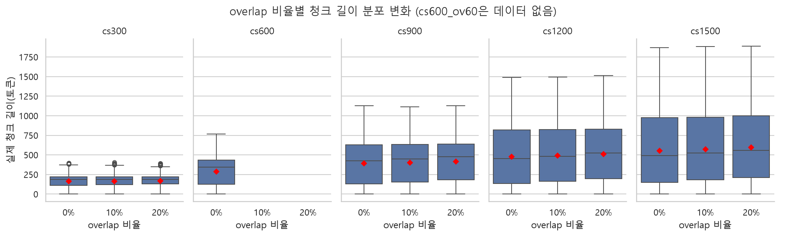

대신 문서당 청크 수는 확실히 늘어남 — 특히 작은 chunk_size(cs300)에서 그 증가폭이 눈에 띔.

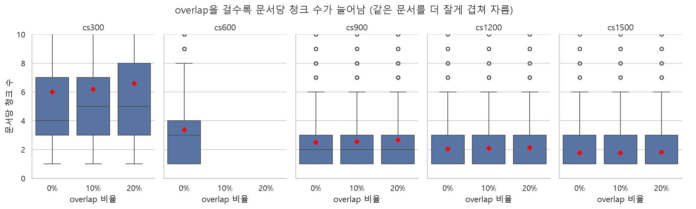

→ overlap의 메커니즘은 "청크를 더 크게"가 아니라 **"경계를 겹쳐서 더 촘촘하게 훑는 것"** — 그래서 청크 길이 분포는 그대로고 개수만 늘어남.

---

## 인사이트 7: overlap의 "비용"(청크 수 증가율)은 chunk_size가 작을수록 크다

20% overlap 적용 시 총 청크 수(=임베딩/스토리지 비용) 증가율:

| chunk_size | 20% overlap 시 청크 수 증가 |
|---|---|
| cs300 | **+12.0%** |
| cs900 | +6.6% |
| cs1200 | +4.5% |
| cs1500 | +4.7% |

10% overlap만 보면 cs1200은 **+1.8%**로 사실상 공짜에 가까움.

→ 작은 청크일수록 같은 overlap 비율(%)이라도 문서 전체에 걸쳐 겹치는 구간이 상대적으로 더 많아져 비용이 커짐. **cs1200+10%가 "효과는 있는데 비용은 거의 안 드는" 조합**이라는 근거가 하나 더 늘어남.

---

## 종합 결론

> chunk_size 선택은 "검색 순위를 얼마나 잘 맞추나"의 문제가 아니라 **"문서 유형에 맞게, 근거가 안 잘리도록 담았나"의 문제였다.** doc_page 기준으로 봤을 때 1200(char)/900~1024(token)가 포화점 직전이면서 gold 경계 안전권(98%+)에 드는 지점이다. overlap은 청크 길이가 아니라 개수만 늘리는 방식으로 효과를 내며, 그 비용(청크 수 증가)은 chunk_size가 클수록 작아진다 — **cs1200+10%가 "효과 대비 비용"이 가장 낮은 조합.**
