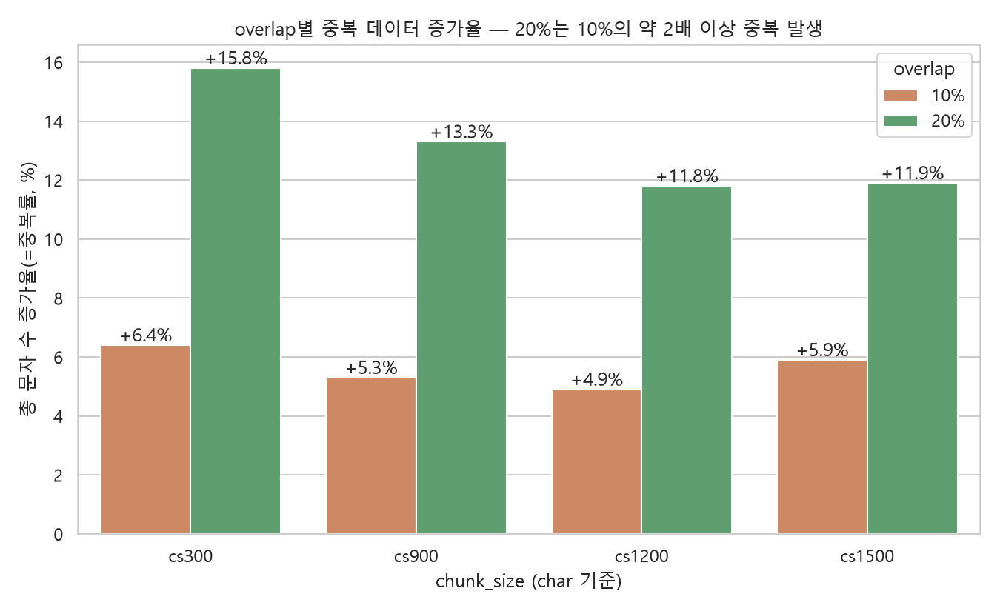

# overlap 심화 EDA — 경계 복구율 vs 중복 비용

*1~2페이지(EDA 핵심인사이트/테이블)에 이어지는 overlap 전용 심화 분석. 청크 길이/개수 분포만으로는 "10% vs 20%"를 직접 증명하기 부족하다는 지적을 반영해, overlap의 목적(경계 손실 복구)과 비용(중복 데이터)을 직접 계산했다.*

---

## 핵심 발견: cs1200/1500은 10%에서 이미 100% 복구, 20%는 추가 이득 0

129건 골드셋의 179개 근거 스니펫 중, **overlap 0%에서 청크 경계에 걸려 깨진 스니펫만 따로 추려서** overlap 10%/20%가 그중 몇 %를 실제로 복구하는지 계산했다(전체 보존율이 아니라 "원래 깨졌던 것들의 복구율"이라 더 직접적인 지표).

| chunk_size | 0%에서 깨진 스니펫 수 | 10% 복구율 | 20% 복구율 |
|---|---|---|---|
| cs300 | 35개 | 68.6% | 77.1% |
| cs900 | 8개 | 75.0% | 87.5% |
| **cs1200** | **3개** | **100.0%** | **100.0%** |
| **cs1500** | **1개** | **100.0%** | **100.0%** |

→ **우리가 실제로 채택한 cs1200/1500 구간에서는 10% overlap만으로 깨졌던 근거가 전부 복구되고, 20%로 올려도 더 복구할 게 없다.** (cs300/900처럼 애초에 많이 깨지는 작은 청크에서는 20%가 추가로 도움되지만, 우리 채택 구간과는 무관)

---

## 비용 쪽: 중복 데이터 증가율(=임베딩/스토리지 비용)

overlap 때문에 같은 원문이 얼마나 반복 저장되는지 — 총 청크 문자 수가 overlap 0% 대비 몇 % 늘었는지로 계산.

| chunk_size | 10% 중복률 | 20% 중복률 |
|---|---|---|
| cs300 | +6.4% | +15.8% |
| cs900 | +5.3% | +13.3% |
| **cs1200** | **+4.9%** | +11.8% |
| cs1500 | +5.9% | +11.9% |

→ 20%는 10%보다 중복이 **약 2배 이상** 늘어남 — 그런데 위에서 본 대로 cs1200/1500에서는 20%가 복구 효과를 추가로 주지 않으므로, **20%는 순수하게 비용만 늘리는 선택**이 된다.

---

## 종합: 10% vs 20%의 선택 논리

> cs1200/1500 기준, **10% overlap에서 경계 손실이 이미 100% 복구**되고 중복 비용은 +4.9~5.9%뿐이다. **20%로 올려도 복구되는 근거는 늘지 않고(0건 추가) 중복 비용만 2배 이상(+11.8~11.9%) 늘어난다.** 이게 overlap=10%를 확정한 가장 직접적인 근거다.

---

## 아직 안 한 것 (다음 단계 후보)

- **Top-K 검색결과 중복도** — overlap이 커지면 검색 상위 K개가 같은 문서의 인접 청크로 쏠리는지(중복 검색) — 실제 벡터 검색을 돌려야 해서 아직 안 함
- **경계형 질문만 분리한 Hit@K** — 근거가 원래 경계에 걸렸던 질문만 따로 떼서 overlap별 검색 성능을 비교 — 이것도 벡터 검색 필요, 아직 안 함
- 위 두 개는 로컬 LLM(생성/채점) 없이 임베딩+벡터검색만으로 가능해서, 필요하면 지금 바로 돌릴 수 있음
