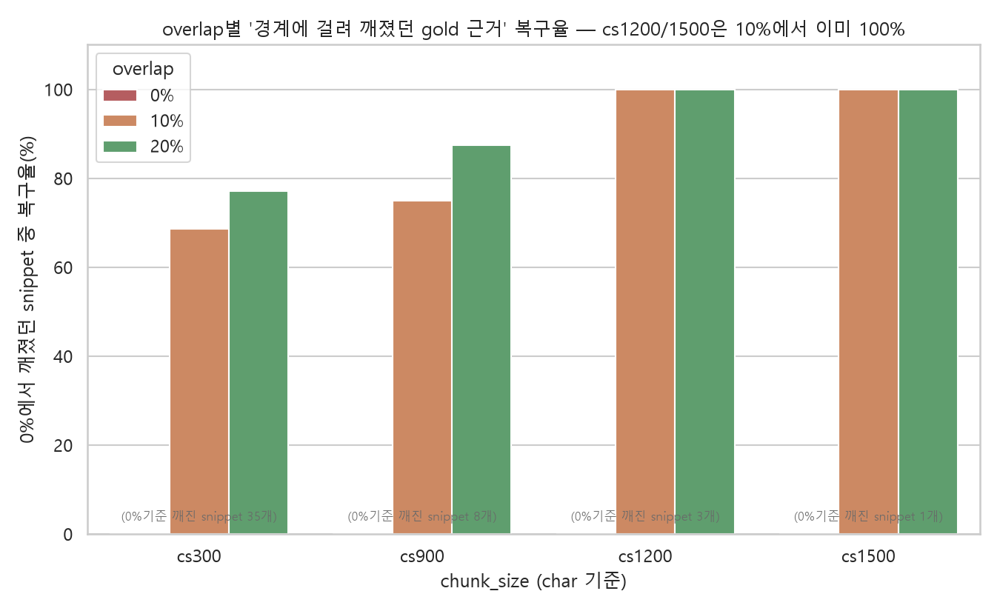

# P2. Chunk size · Overlap 결정 근거 (EDA)

## 왜 이 문제가 생기나 — 문서유형별 원문 길이 차이

doc_page는 원문 자체가 김(중앙값 807토큰, 최대 23,665토큰) — chunk_size가 실질적으로 영향을 주는 건 사실상 doc_page뿐. action_schema/package_overview는 원래 짧아 chunk_size와 거의 무관.

---

## Chunk size — 작을수록 손해, 클수록 이득 없음

| 설정 | 근거 보존율 | 단일 청크 문서 비율 |
|---|---|---|
| cs300 | 80.4% | 14.9% |
| **cs1200** | **98.3%** | **60.9%** |
| cs1500 | 99.4% | 70.1% |

**핵심 문구**: 1200자에서 근거의 98.3%를 보존했다. 1500자로 늘려도 개선은 1.1%p에 그쳤다.

- 너무 작을 때: 근거 문장이 여러 청크로 잘림 → 보존율 낮음, 문서당 청크 수 과다, 검색 결과가 조각 단위로 흩어짐
- 너무 클 때: 문서 전체가 한 청크에 들어가는 비율이 커짐 → 청크 간 구분력 약화, 불필요한 문맥까지 검색, 임베딩·비용 증가

---

## Overlap — 10%에서 경계 손실 대부분 복구, 20%는 중복만 증가

129건 골드셋의 179개 근거 스니펫 중 **0%에서 실제로 청크 경계에 걸려 깨진 것만 추려서** overlap별 복구율을 계산(전체 평균이 아니라 "깨졌던 것들의 복구율"이라 더 직접적):

| chunk_size | 0%에서 깨진 스니펫 | 10% 복구율 | 20% 복구율 |
|---|---|---|---|
| **cs1200** | 3개 | **100.0%** | 100.0% (추가 이득 0) |
| **cs1500** | 1개 | **100.0%** | 100.0% (추가 이득 0) |

반대로 중복 데이터(=임베딩/스토리지 비용) 증가율은:

| chunk_size | 10% | 20% |
|---|---|---|
| cs1200 | +4.9% | +11.8% |
| cs1500 | +5.9% | +11.9% |

**핵심 문구**: 10%에서 경계 손실을 대부분(cs1200/1500은 100%) 보완하고, 20%는 추가 개선 없이 중복 비용만 2배 이상 늘어난다.

---

## 종합

> chunk_size=1200(char), overlap=10%는 "근거를 안 잃으면서 비용을 최소화하는" 지점이다.
