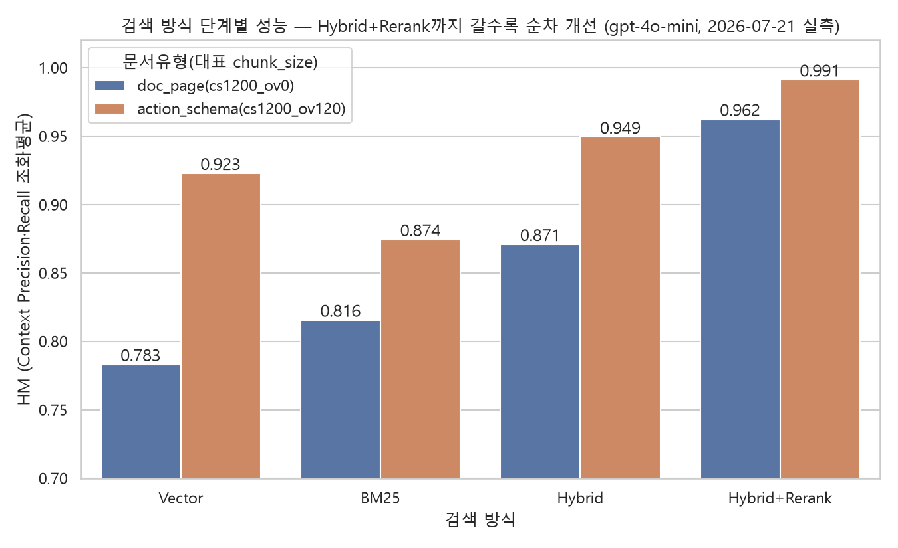

# P3. Vector · BM25 · Hybrid · Reranker 기여도

*실측: gpt-4o-mini, 2026-07-21, cs1200 기준(doc_page=overlap 0%, action_schema=overlap 10%). candidate_k=20(양쪽), rrf_k=60, 가중치 1:1, rerank 후보 20개→top_k=5.*

---

## 단계별 성능 (HM = Context Precision·Recall 조화평균)

| 방식 | doc_page(cs1200_ov0) | action_schema(cs1200_ov120) |
|---|---|---|
| Vector | 0.783 | 0.923 |
| BM25 | 0.816 | 0.874 |
| Hybrid | 0.871 | 0.949 |
| **Hybrid+Rerank** | **0.962** | **0.991** |

## 문서유형별로 유리한 검색 방식이 다르다

- **doc_page**: BM25 단독이 Vector 단독보다 나음 — 자연어 설명 위주라 키워드 매칭이 유리
- **action_schema**: 반대로 Vector 단독이 BM25보다 나음 — 액션명·설명이 의미 유사도로 더 잘 잡힘
- **둘 다 Hybrid로 합치면 더 좋아지고, Reranker가 최종적으로 가장 크게 기여함** (doc_page +0.091, action_schema +0.042)

## 로컬 EXAONE으로도 재확인(2026-07-26, tok1024 기준)

| 지표 | Vector-only | Hybrid+Rerank |
|---|---|---|
| Hit@1 | 0.341 | 0.690 |
| MRR | 0.452 | 0.799 |
| Context Precision | 0.736 | 0.946 |
| Context Recall | 0.864 | 0.977 |

→ gpt-4o-mini 결론이 다른 모델(로컬 EXAONE)로도 그대로 재현됨.

---

## 종합 결론

> **BM25와 Vector는 서로 다른 문서유형에서 강점이 갈리므로 둘 다 필요하다. Hybrid로 결합하면 항상 개선되고, Reranker가 최종 품질을 가장 크게 끌어올린다.**
