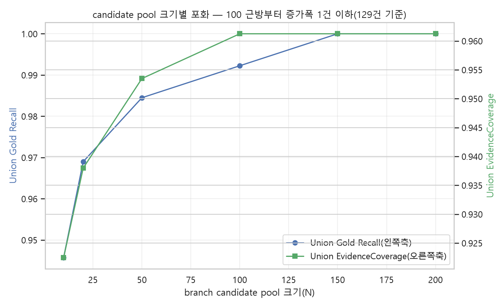
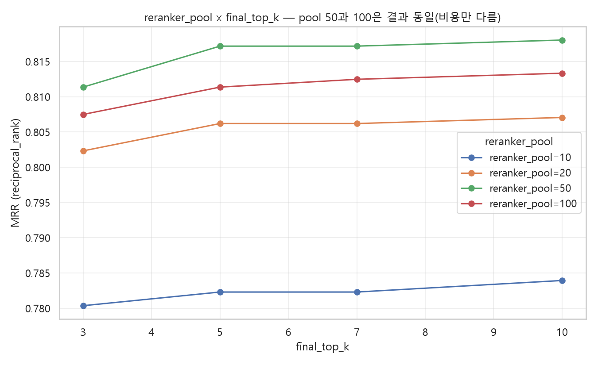

# P4. Candidate Pool · Top-K · 결합 방식 탐색

*실측: 로컬 EXAONE-4.0, tok1024 기준, 129건 전체. 단계적 탐색(pool 포화점→fusion 방식→reranker_pool×top_k)으로 진행, 전수교차 아님.*

---

## Candidate pool — 100 근방부터 포화



```text
10~50  → 검색 후보 부족, 늘릴수록 뚜렷이 개선
100    → Union Gold Recall 99.2%, EvidenceCoverage 96.1% — 이후 증가폭 129건 기준 1건 이하
150~200 → 100 대비 추가 이득 사실상 없음
```

→ **pool=100~150이 "늘리는 이득이 있는 마지막 지점"**, 200까지 늘릴 필요는 없음.

---

## Reranker pool × Final top-k



```text
reranker_pool 10  → 명확히 열세
reranker_pool 20  → 현재 운영값, 나쁘지 않음
reranker_pool 50  → 20 대비 개선
reranker_pool 100 → 50과 결과 완전히 동일(추가 이득 0, latency만 증가)
```

→ **reranker_pool=50이면 충분, 100은 비용만 늘어남.**

---

## 결합 방식(Fusion) — 진행 중인 검증

1단계 스크리닝(자체 evidence_coverage 지표 기준)에서는 **RRF보다 정규화 융합(min-max + arithmetic_mean, BM25 가중치 높게)이 전반적으로 우세**했다. 다만 이 스크리닝 지표가 실제 RAGAS Context Precision/Recall과 완전히 일치하지 않는다는 게 나중에 확인되어, **현재 16개 fusion 설정 전체를 실제 Context Precision/Recall로 재채점하는 중**(진행률: 이 페이지 작성 시점 기준 미완료). 최종 결론은 재채점 완료 후 업데이트 예정.

현재까지 확정적으로 말할 수 있는 것:

- RRF든 정규화 융합이든, **anchor(RRF) 대비 정규화 융합 후보들의 차이는 129건 표본에서 통계적으로 유의하지 않음**(28개 검정 중 0개 유의)
- 즉 결합 방식을 정규화로 바꾸더라도 "확실히 낫다"고 말하기는 이르고, 현재 RRF 유지도 방어 가능한 선택

---

## 비용-이득 요약

| 설정 증가 | 얻는 것 | 발생하는 비용 |
|---|---|---|
| Candidate pool 증가 (50→100) | Recall/Coverage 소폭 증가, 100 이후 정체 | Reranking 대상 증가 |
| Reranker pool 증가 (20→50) | 검색 품질 개선 | latency 소폭 증가 |
| Reranker pool 증가 (50→100) | 개선 없음 | latency만 증가 |
| Top-k 증가 | Evidence Coverage 증가 | Context Precision 저하 가능·토큰 증가 |

---

## 종합

> **검색 후보를 충분히 확보하되(pool 100, rerank 50), 추가 후보의 이득이 줄어드는 지점에서 제한했다. 결합 방식(RRF vs 정규화 융합) 최종 검증은 진행 중.**
